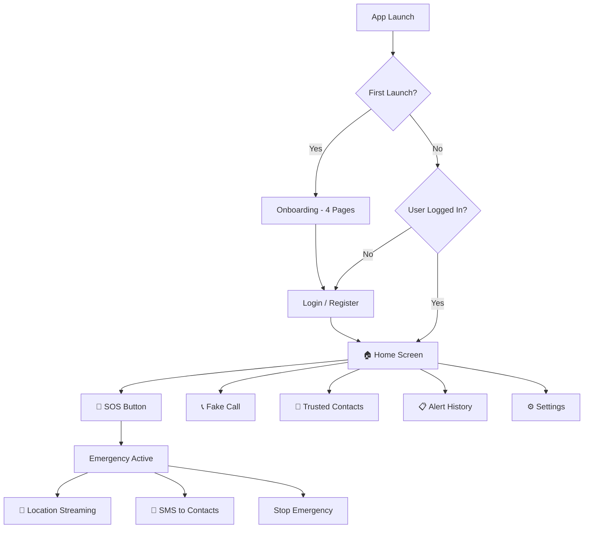
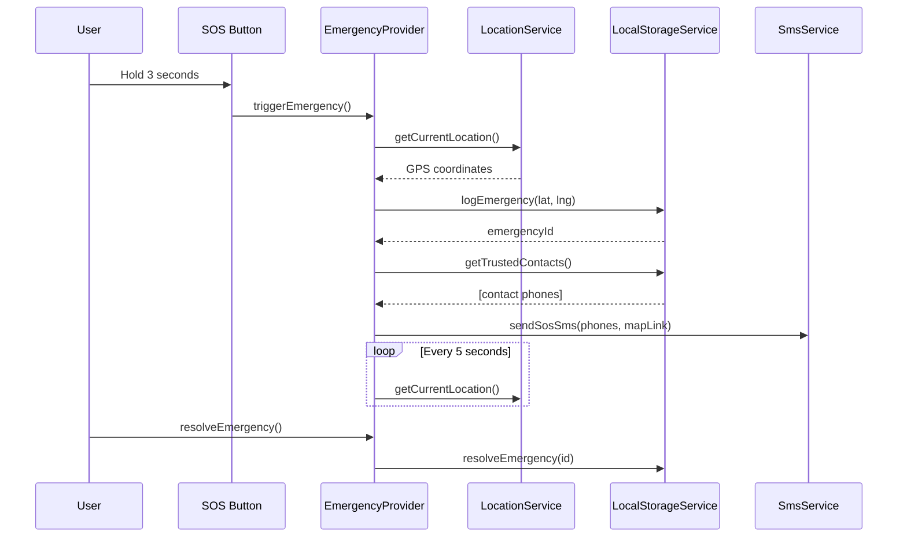

# AI Raksha — Comprehensive App Report

## Overview

**AI Raksha** is a personal safety application built with Flutter, designed to provide instant emergency response capabilities. The app enables users to alert trusted contacts with their live location during emergencies, schedule fake incoming calls to exit unsafe situations, and maintain a history of all emergency events — all without requiring any external API keys or cloud backend.

> [!IMPORTANT]
> The app operates **entirely offline** using on-device Hive storage. No Firebase, no cloud backend, no API keys required.

---

## App Flow



---

## Features

### 1. Onboarding (First Launch Only)
| Aspect | Detail |
|--------|--------|
| Pages | 4 swipeable intro screens |
| Content | Shield → SOS Button → Contacts → Fake Call |
| UI | Glowing icons, animated page indicators, skip button |
| Persistence | `SharedPreferences` flag — shown only once |

### 2. Authentication
| Aspect | Detail |
|--------|--------|
| Method | Email + password (local Hive storage) |
| Registration | Name, email, phone (optional), password |
| Session | Persistent — stays logged in across app restarts |
| Security | Password stored locally on-device |
| UI | Premium dark cards, shield logo, animated loading |

### 3. SOS Emergency Button (Core Feature)
| Aspect | Detail |
|--------|--------|
| Activation | Hold for 3 seconds |
| Visual | Pulsating red glow, circular countdown ring |
| Haptic | Vibration feedback during hold |
| On Trigger | Fetches GPS → logs emergency → sends SMS → streams location |
| Location | Streams GPS every 5 seconds while active |
| SMS | Sends Google Maps link to all trusted contacts |
| Resolution | Tap STOP to end emergency and update history |

### 4. Trusted Contacts
| Aspect | Detail |
|--------|--------|
| Storage | Hive local database |
| Fields | Name, phone number, relation |
| Operations | Add (dialog), delete (swipe), view |
| Integration | Contacts receive SMS during emergencies |

### 5. Fake Call
| Aspect | Detail |
|--------|--------|
| Delays | 10 seconds, 30 seconds, 1 minute |
| UI | Simulated incoming call screen |
| Features | Animated ring glow, accept/decline buttons, call timer |
| Purpose | Quick escape from uncomfortable or unsafe situations |

### 6. Alert History
| Aspect | Detail |
|--------|--------|
| Data | All logged emergencies with timestamps |
| Status | ACTIVE (red) or RESOLVED (green) badges |
| Info | Date/time, GPS coordinates |
| Storage | Hive local database |

### 7. Settings
| Feature | Detail |
|---------|--------|
| Profile | Name, email display |
| Logout | Confirmation dialog, clears session |
| App Info | Version number, privacy policy link |

---

## Technology Stack

| Layer | Technology |
|-------|------------|
| **Framework** | Flutter (Dart) |
| **State Management** | Riverpod 3.x (`AsyncNotifier`, `NotifierProvider`) |
| **Navigation** | GoRouter with auth-based redirect |
| **Local Storage** | Hive (auth, contacts, emergencies) |
| **Preferences** | SharedPreferences (onboarding flag) |
| **Location** | Geolocator |
| **Maps** | flutter_map + latlong2 (OpenStreetMap — free, no API key) |
| **SMS** | url_launcher (opens native SMS app) |
| **Audio** | audioplayers |
| **Notifications** | flutter_local_notifications |

---

## File Structure

```
lib/
├── main.dart                              # App entry point
├── core/
│   ├── constants/
│   │   └── app_colors.dart                # Color palette & gradients
│   ├── theme/
│   │   └── app_theme.dart                 # Material 3 dark theme
│   ├── router/
│   │   └── app_router.dart                # GoRouter with onboarding/auth flow
│   └── services/
│       ├── local_storage_service.dart      # Hive CRUD (auth, contacts, emergencies)
│       ├── location_service.dart           # GPS via Geolocator
│       └── sms_service.dart               # SMS via url_launcher
├── features/
│   ├── onboarding/screens/
│   │   └── onboarding_screen.dart         # 4-page intro
│   ├── auth/
│   │   ├── providers/
│   │   │   └── auth_provider.dart         # AsyncNotifier for login/register/logout
│   │   └── screens/
│   │       ├── login_screen.dart
│   │       └── register_screen.dart
│   ├── emergency/
│   │   ├── providers/
│   │   │   └── emergency_provider.dart    # SOS workflow (trigger → SMS → stream → resolve)
│   │   ├── screens/
│   │   │   ├── home_screen.dart           # Main screen with SOS + quick actions
│   │   │   └── fake_call_screen.dart      # Simulated call UI
│   │   └── widgets/
│   │       └── sos_button.dart            # Animated SOS button
│   ├── contacts/
│   │   ├── models/
│   │   │   └── contact_model.dart         # TrustedContact data class
│   │   ├── providers/
│   │   │   └── contacts_provider.dart     # CRUD notifier
│   │   └── screens/
│   │       └── contacts_screen.dart       # Add/delete contacts
│   ├── history/screens/
│   │   └── history_screen.dart            # Emergency timeline
│   └── profile/screens/
│       └── settings_screen.dart           # Profile + logout
```

---

## Design System

| Token | Value |
|-------|-------|
| **Primary** | `#FF3B3B` (Emergency Red) |
| **Secondary** | `#0F172A` (Navy Blue) |
| **Accent** | `#FFD700` (Gold) |
| **Background** | Gradient: `#0a0e21` → `#1a1a2e` |
| **Cards** | Glassmorphism: `#FFFFFF 5%` → `#FFFFFF 2%` |
| **Typography** | Inter font, Material 3 |
| **Theme** | Dark mode only |

---

## Data Flow



---

## What Was Fixed

1. **Firebase crash** → Removed Firebase entirely (native Gradle plugins + [google-services.json](file:///d:/AI%20rakhsha/airakhsha/android/app/google-services.json) + Dart packages)
2. **Google Maps API key** → Replaced with `flutter_map` + OpenStreetMap (free)
3. **Missing onboarding** → Added 4-page intro shown on first launch only
4. **Broken auth** → Replaced Firebase Auth with Hive local auth
5. **7 obsolete files deleted** → [firebase_options.dart](file:///d:/AI%20rakhsha/airakhsha/lib/firebase_options.dart), [firestore_service.dart](file:///d:/AI%20rakhsha/airakhsha/lib/core/services/firestore_service.dart), [auth_repository.dart](file:///d:/AI%20rakhsha/airakhsha/lib/features/auth/repositories/auth_repository.dart), [wearable_sync_service.dart](file:///d:/AI%20rakhsha/airakhsha/lib/core/services/wearable_sync_service.dart), [audio_recorder_service.dart](file:///d:/AI%20rakhsha/airakhsha/lib/features/emergency/services/audio_recorder_service.dart), [shake_detector_service.dart](file:///d:/AI%20rakhsha/airakhsha/lib/features/emergency/services/shake_detector_service.dart), [voice_activation_service.dart](file:///d:/AI%20rakhsha/airakhsha/lib/features/emergency/services/voice_activation_service.dart)
6. **6 heavy packages removed** → Firebase, Google Maps, Porcupine, Shake, Record, Socket.io

---

## Known Limitations

| Limitation | Mitigation |
|-----------|------------|
| Local auth only (no cloud sync) | Data persists on-device; can add Firebase later when configured |
| SMS opens native SMS app | Direct SMS send requires paid SMS API or platform permissions |
| No real-time map display in home | `flutter_map` is available for future map integration |
| Password stored in plaintext locally | Acceptable for offline-only; hash if deploying to production |
